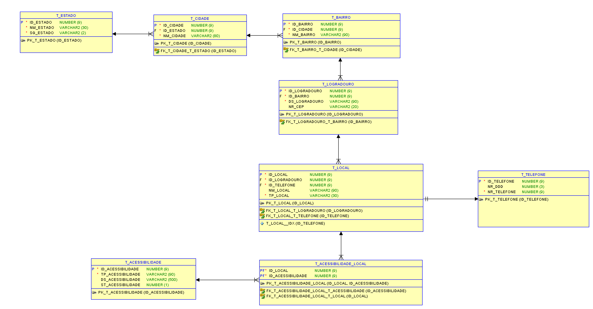
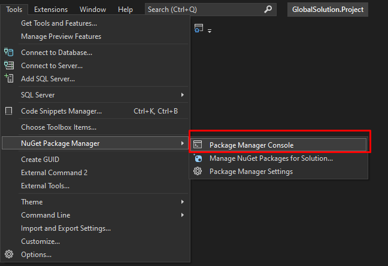
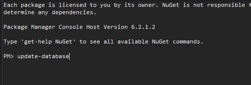

# GlobalSolution-Project-Enterprise
Projeto Global Solution referente a matéria de Enterprise Application Development 
---------------------------------------------------------------------------------------------------------------------------------------------------- 

# Integrantes
 - Gabriel Sun Gonçalo da Silva                **RM: 88316**
 - Kleber Albert de Sousa Monteiro             **RM: 88711**
 - Renato Miranda Esmail                       **RM: 86701**

----------------------------------------------------------------------------------------------------------------------------------------------- 

# Introducao
- Nossa solução tem como objetivo ser uma plataforma, no qual as pessoas possam cadastrar locais que tenham acessibilidade.

- Para que assim seja criada uma comunidade em que pessoas contribuam informando locais que tenham acessibilidade.

---------------------------------------------------------------------------------------------------------------------------------------------------- 

# Modelagem

---------------------------------------------------------------------------------------------------------------------------------------------------- 

# Como iniciar o Aplicativo
- Ao abrir o Visual Studio ir na aba Tools -> NuGet Package Manager -> Package Manager Console
- Ao abrir o console digitar: "update-database"

